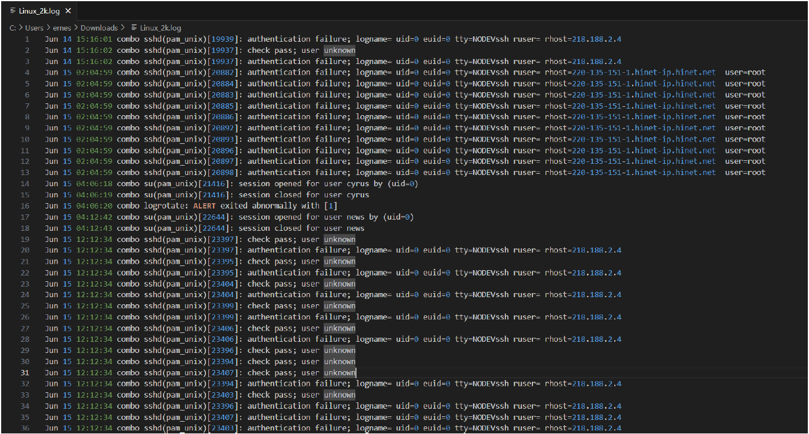
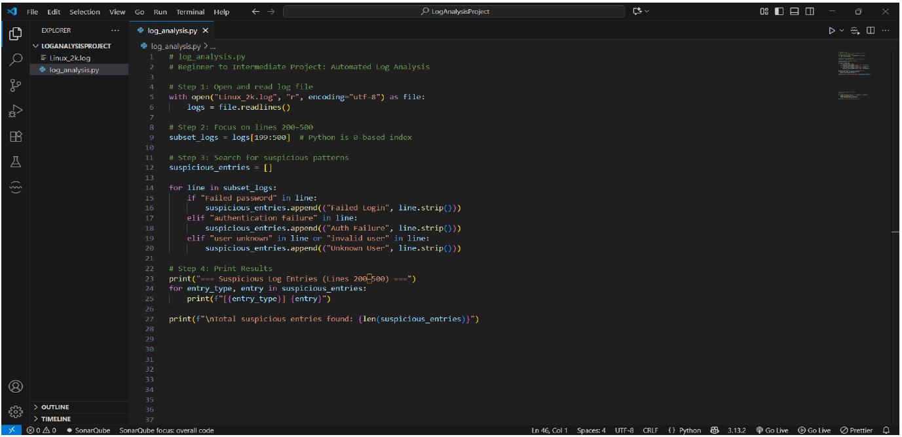
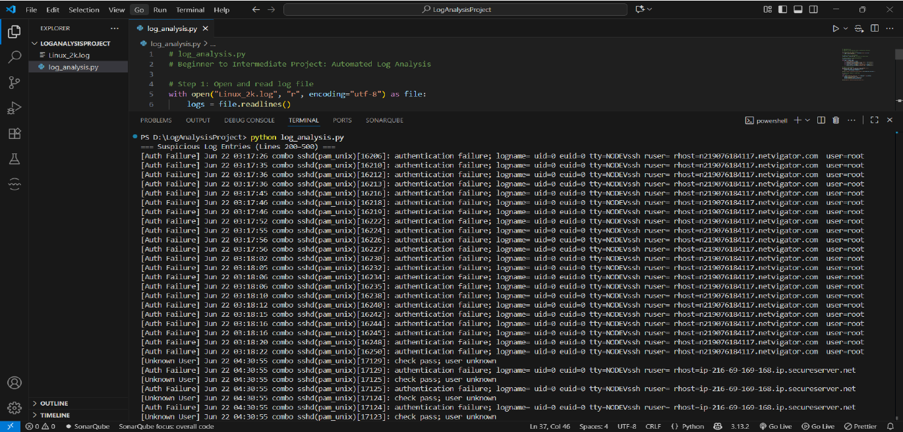
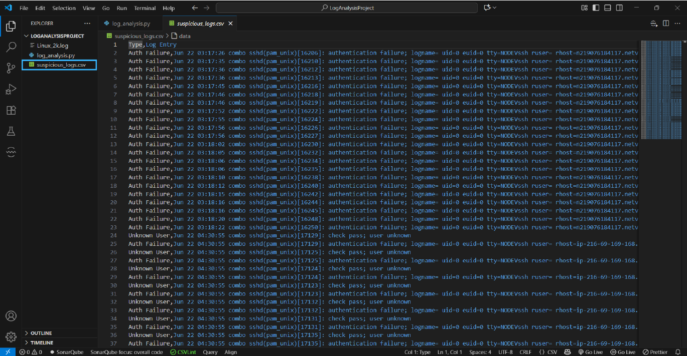
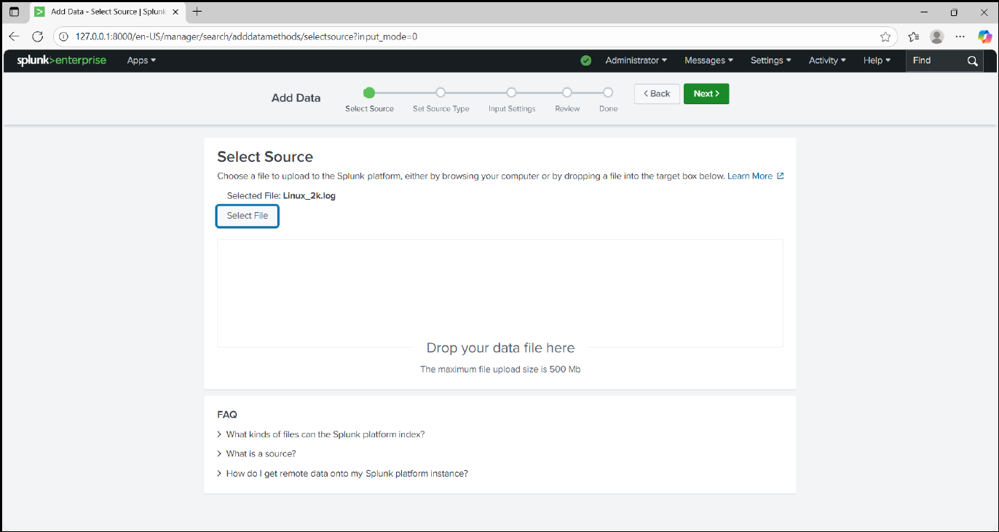
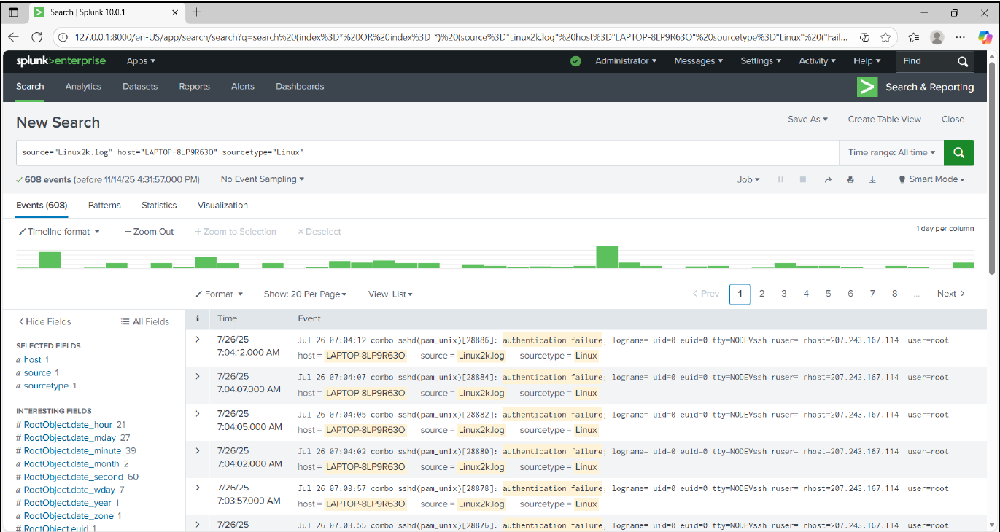
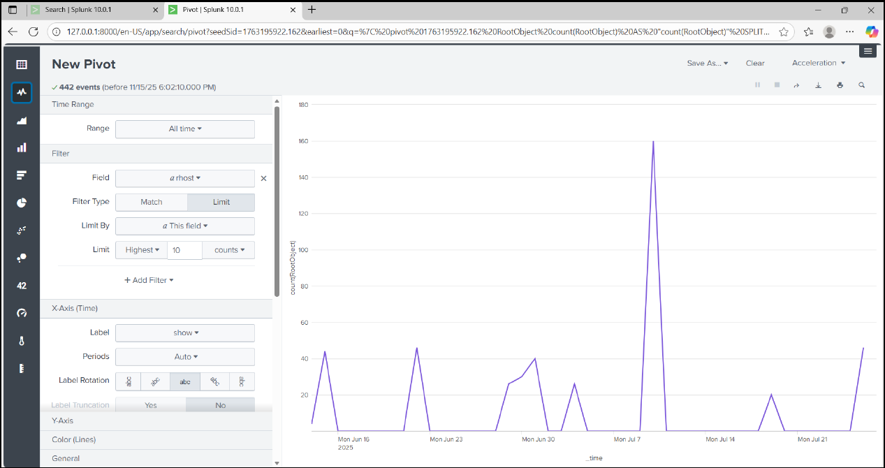

# Linux Log Analysis, Detection Automation & SIEM Investigation

## Overview

This project demonstrates an end-to-end cybersecurity investigation workflow focused on identifying suspicious authentication activity within Linux systems.

The project combines manual log analysis, Python-based detection automation, and Security Information and Event Management (SIEM) capabilities using Splunk Enterprise to detect, analyze, and visualize indicators of potential brute-force attacks and unauthorized access attempts.

Through this project, Linux authentication logs were examined to identify authentication failures, invalid user activity, and repeated login attempts targeting privileged accounts. The findings were then validated and visualized within Splunk to simulate a real-world Security Operations Center (SOC) investigation process.

---

## Objectives

* Investigate Linux authentication logs for suspicious activity.
* Identify authentication failures and unauthorized access attempts.
* Automate detection of suspicious events using Python.
* Generate structured security reports for analysis.
* Validate findings through SIEM-based investigation.
* Visualize attack patterns and trends.
* Apply security monitoring techniques commonly used in SOC environments.

---

## Technologies and Tools

| Technology                | Purpose                    |
| ------------------------- | -------------------------- |
| Linux Authentication Logs | Security Event Source      |
| Python 3                  | Log Analysis Automation    |
| Visual Studio Code        | Development Environment    |
| CSV Reporting             | Structured Output          |
| Splunk Enterprise         | SIEM Investigation         |
| Excel                     | Data Review and Validation |

---

## Cybersecurity Skills Demonstrated

### Security Operations Center (SOC)

* Security Monitoring
* Log Analysis
* Threat Hunting
* Event Investigation
* Security Reporting
* Incident Analysis

### Detection Engineering

* Authentication Failure Detection
* Brute-Force Activity Identification
* Event Correlation
* Security Data Processing

### SIEM Operations

* Log Ingestion
* Event Search and Filtering
* Statistical Analysis
* Security Visualization
* Attack Pattern Identification

### Scripting and Automation

* Python Log Parsing
* Data Extraction
* Event Classification
* Automated Reporting

---

## Investigation Methodology

### Manual Log Analysis

The investigation began with a manual review of Linux authentication logs to understand event structure and identify potential indicators of malicious activity.

The analysis focused on:

* Failed password attempts
* Authentication failures
* Invalid user accounts
* Unknown user activity
* Privileged account targeting

Manual review enabled identification of suspicious authentication patterns and provided a baseline for automation.

### Detection Automation

To improve efficiency and scalability, a Python script was developed to automate the detection process.

The script performs the following functions:

* Reads Linux authentication logs
* Extracts relevant log entries
* Searches for predefined suspicious patterns
* Classifies events based on activity type
* Generates structured output for reporting

Detected events include:

* Failed Login Attempts
* Authentication Failures
* Invalid User Activity
* Unknown User Activity

Results are exported into CSV format to support further investigation and reporting.

### SIEM Investigation

The Linux log dataset was ingested into Splunk Enterprise for centralized analysis.

Custom searches were performed to identify authentication-related anomalies and validate findings discovered during manual and automated analysis.

Splunk was used to:

* Search and filter security events
* Correlate authentication failures
* Identify recurring attack sources
* Analyze event frequency
* Visualize attack trends

This phase simulates how security analysts investigate suspicious activity within enterprise environments.

---

## Splunk Search Query

```spl
source="Linux2k.log"
("Failed password"
OR "authentication failure"
OR "invalid user"
OR "user unknown")
```

This search isolates authentication-related events that may indicate unauthorized access attempts, account enumeration, or brute-force activity.

---

## Security Findings

### Finding 1 – Repeated Authentication Failures

Multiple authentication failures were observed across the dataset.

#### Observation

Repeated login attempts occurred within short time intervals against privileged accounts.

#### Security Impact

This behavior is commonly associated with password-guessing attacks and brute-force activity.

#### Risk Rating

High

#### MITRE ATT&CK Mapping

T1110 – Brute Force

---

### Finding 2 – Invalid User Enumeration

Several authentication attempts targeted usernames that did not exist on the system.

#### Observation

Attackers attempted authentication against multiple invalid accounts.

#### Security Impact

This activity may indicate reconnaissance efforts intended to discover valid user accounts before launching further attacks.

#### Risk Rating

Medium

#### MITRE ATT&CK Mapping

T1589 – Gather Victim Identity Information

---

### Finding 3 – Privileged Account Targeting

The root account was repeatedly targeted during authentication attempts.

#### Observation

A significant number of failed logins involved privileged system accounts.

#### Security Impact

Successful compromise of a privileged account could result in complete system access.

#### Risk Rating

High

#### MITRE ATT&CK Mapping

T1078 – Valid Accounts

---

## MITRE ATT&CK Coverage

| Observed Activity            | MITRE ATT&CK Technique |
| ---------------------------- | ---------------------- |
| Failed Login Attempts        | T1110                  |
| Brute-Force Activity         | T1110                  |
| Invalid User Enumeration     | T1589                  |
| Privileged Account Targeting | T1078                  |
| Authentication Abuse         | T1078                  |

---

## Project Evidence

### Manual Log Investigation



### Python Detection Script



### Detection Results



### CSV Security Report



### Splunk Event Investigation



### Splunk Statistical Analysis



### Splunk Visualization Dashboard



---

## Key Outcomes

This project demonstrates practical experience in:

* Linux log analysis
* Security event investigation
* Authentication monitoring
* Detection automation using Python
* SIEM operations using Splunk
* Threat identification and validation
* Security reporting and visualization
* MITRE ATT&CK mapping
* SOC investigation workflows

The project reflects a layered investigation approach where manual analysis, automation, and SIEM capabilities are combined to improve detection accuracy and operational efficiency.

---

## Future Improvements

* Real-time log monitoring and alerting
* Automated detection rules for suspicious authentication behavior
* Integration with Syslog infrastructure
* Enhanced IP reputation analysis
* Threat intelligence enrichment
* Splunk dashboard development
* Automated incident reporting
* Detection coverage expansion using MITRE ATT&CK techniques

---

This project was developed to demonstrate practical SOC analyst skills by combining manual investigation techniques, detection automation, and SIEM-driven threat analysis using real-world Linux authentication logs.
